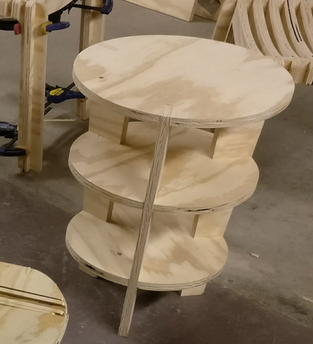
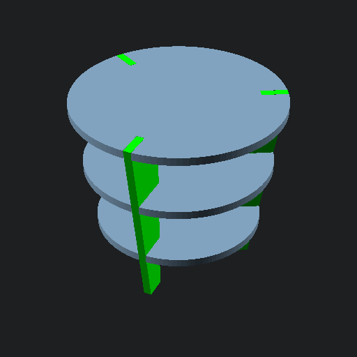
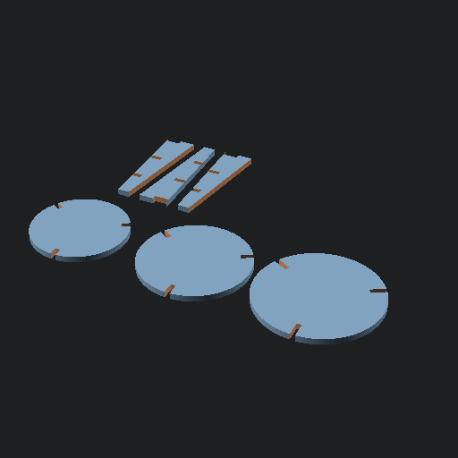
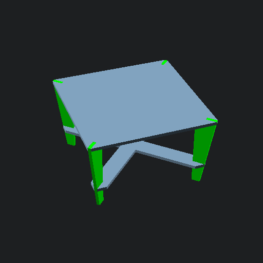
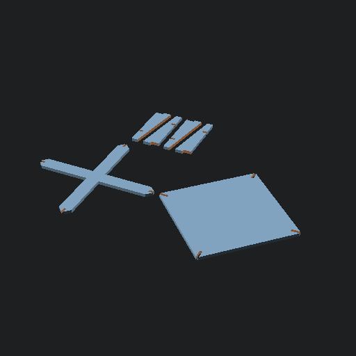
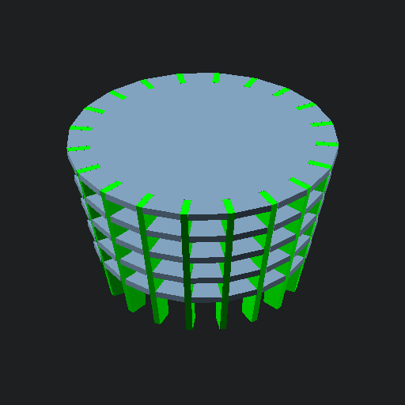
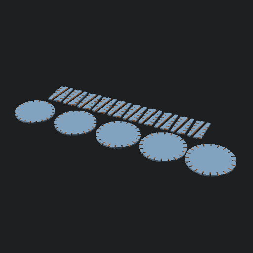

# OpenSCAD End Table Library
Library for building end tables.
# Examples
## Round Table
This one wasn't very stable, I don't recommend three legs with a round top.

## Square Table
This one worked much better but it was so unremarkable I forgot to take a picture before I threw it away.

## Crazy Table
Demo of adding many shelves and legs.

